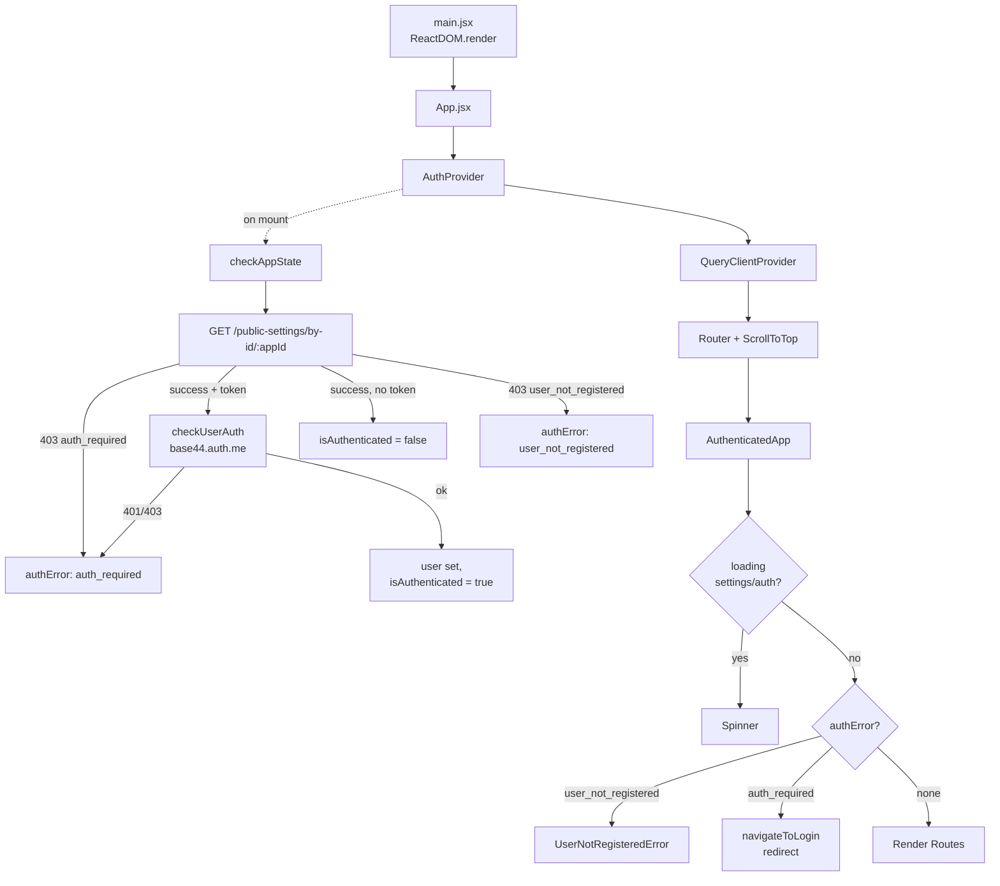
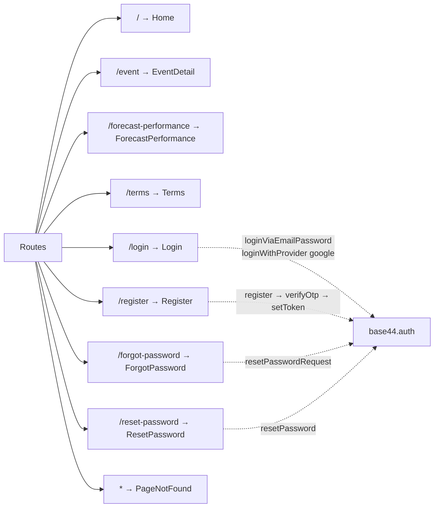
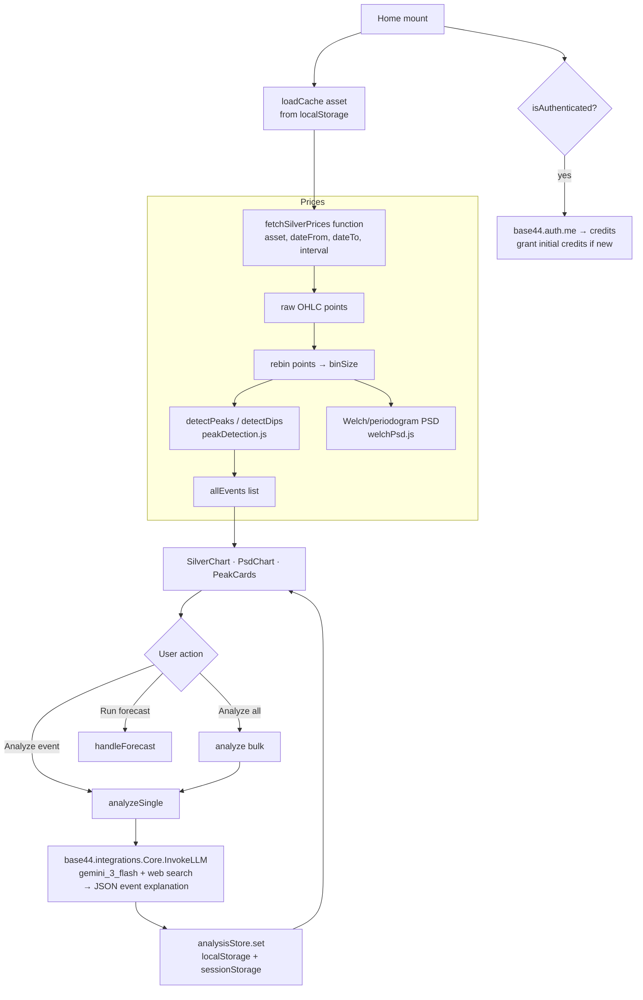
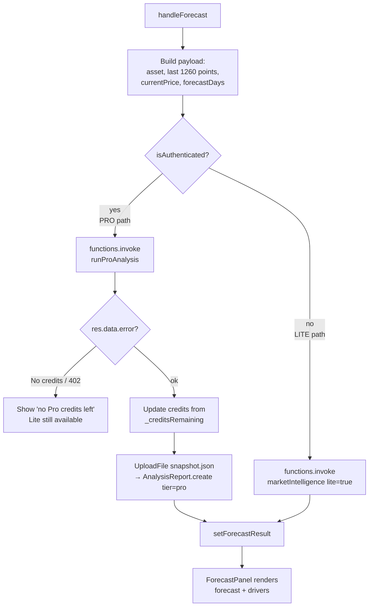
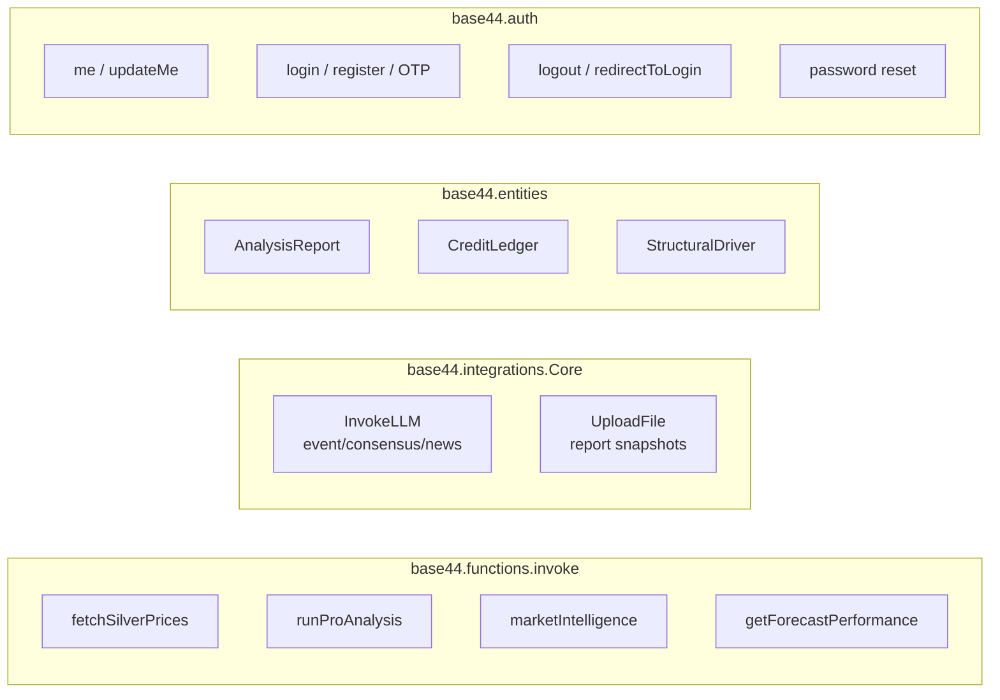

# SilverInsight AI — Application Flowchart

A React + Vite single-page app on the **Base44** platform. It fetches silver/gold
price history, detects peaks/dips, runs spectral (PSD) analysis, generates
AI-driven forecasts and event explanations, and gates "Pro" features behind a
credit system.

---

## 1. Boot & Authentication Flow

## 2. Routing Map

## 3. Home Page — Core Data & Analysis Flow

The **analysisStore** (`src/lib/analysisStore.js`) is a module-level pub/sub cache
that survives component unmounts and persists per-asset to `localStorage`, so
in-flight and completed event analyses survive navigation and reloads.

## 4. Forecast Flow — Pro vs Lite (credit gating)

**Credits are granted, never bought.** The Stripe purchase flow —
`stripeCreateCheckout`, `stripeWebhook` and `BuyCreditsModal` — was removed from
this build. The only source of credits is the initial grant of 3 to a
first-time authenticated user (`Home.jsx`, via `auth.updateMe`); the grant uses
`max(existing, 3)` so it never reduces a balance that is already higher.
Running out of Pro credits is therefore terminal for that account, and the UI
says so rather than offering a purchase that no longer exists. Lite forecasts
are unaffected.

`CreditLedger` keeps its `stripe_purchase` enum value and `stripeSessionId`
field so historical rows stay valid; nothing writes either any more.

## 5. Backend Functions & Entities (Base44 SDK surface)

**Feature → API mapping**

| Feature | Component / Page | Base44 call |
|---|---|---|
| Price history | Home, EventDetail | `functions.fetchSilverPrices` |
| Pro forecast | Home | `functions.runProAnalysis` |
| Lite forecast | Home | `functions.marketIntelligence` (lite) |
| Event explanation | Home, EventDetail | `integrations.Core.InvokeLLM` |
| External consensus / live news | ExternalConsensus, LiveNewsDot | `integrations.Core.InvokeLLM` |
| Saved reports | SavedReports, Home | `entities.AnalysisReport`, `UploadFile` |
| Credit balance & history | CreditHistory, Home | `auth.updateMe` (initial grant), `entities.CreditLedger` (read-only) |
| Structural drivers (admin) | StructuralDriversPanel | `entities.StructuralDriver` |
| Forecast accuracy | ForecastPerformance | `functions.getForecastPerformance` |
| Auth | Login/Register/… | `base44.auth.*` |
